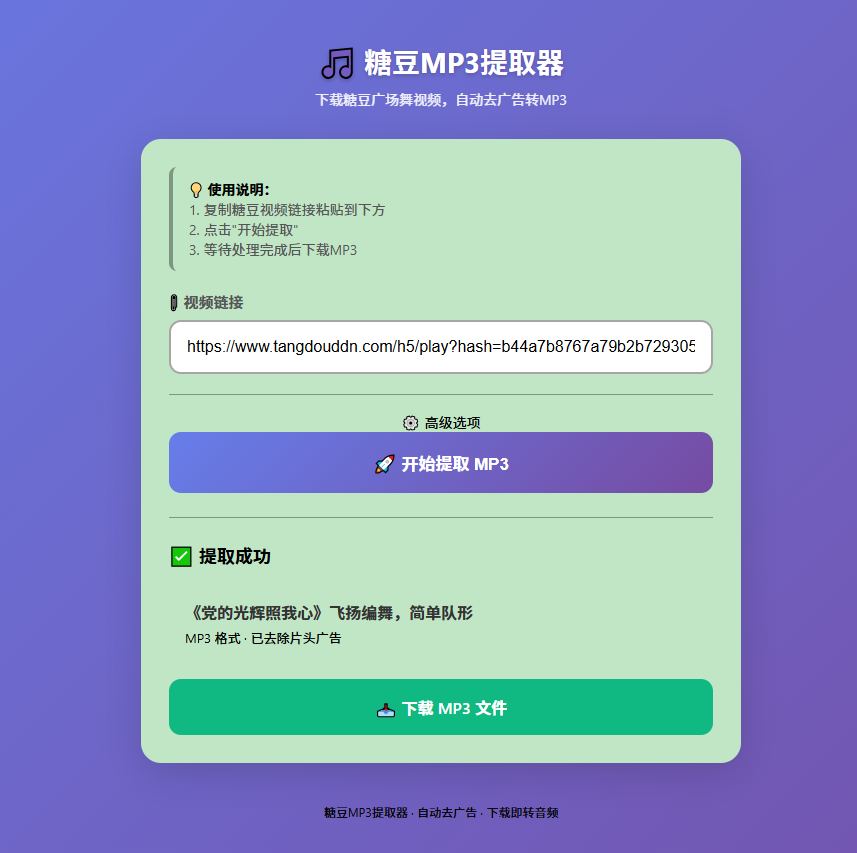

# 糖豆MP3提取器

糖豆广场舞视频自动下载、去广告、转MP3的Web工具。

## 功能特点

- **手机友好界面** - 简洁直观的操作体验
- **一键提取** - 粘贴链接，后台队列自动处理
- **自动去广告** - 默认剪掉前 5 秒片头
- **省流量** - 自动选择最低清晰度下载
- **可靠队列** - Redis + RQ Worker 处理下载/转换任务
- **状态恢复** - 任务状态 Redis + 本地 JSON 双写，Redis 异常时可降级查询
- **重复提交保护** - 3 小时保留期内拒绝相同 `vid + skip_seconds`
- **断点下载** - 支持 Range 分段下载、`.part` 续传和转换结果校验

## 技术栈

- **后端**: Flask + Gunicorn
- **任务队列**: Redis + RQ
- **包管理**: [uv](https://github.com/astral-sh/uv)
- **视频处理**: FFmpeg (下载 → 剪辑 → 转MP3)
- **部署**: Ubuntu + systemd 用户服务

## 项目结构

```
tangdou-web/
├── app.py                  # Flask主应用
├── wsgi.py                 # WSGI入口
├── requirements.txt        # Python依赖
├── README.md               # 项目文档
├── REDIS_QUEUE.md          # Redis/RQ 架构说明
├── OPERATIONS.md           # 运维手册
├── modules/                # 核心模块
│   ├── tangdou.py          # 视频API（复用原有代码）
│   ├── headers.py          # 请求头（复用原有代码）
│   └── downloader.py       # 分段下载与FFmpeg转换
├── tasks/                  # 后台任务
│   ├── processor.py        # 兼容入口
│   └── reliable_processor.py # Redis/RQ任务处理
├── templates/              # HTML模板
│   ├── base.html
│   └── index.html
├── static/downloads/       # 下载文件与本地任务状态
└── scripts/                # 部署脚本
    ├── install.sh              # 系统级安装（需要sudo）
    ├── install-user-service.sh # 用户级服务安装（推荐⭐）
    ├── deploy_redis_queue.sh   # Redis/RQ部署
    ├── rq_worker.py            # RQ Worker入口
    ├── cleanup.py              # 本地文件/任务清理
    ├── cleanup_redis.py        # Redis缓存/队列清理
    └── uninstall.sh            # 清理卸载
```

## 部署方式

### 方式一：用户级服务（推荐⭐）

**无需 sudo**，后台常驻运行，支持开机自启。

```bash
# 1. 下载代码到用户目录
cd ~
git clone <你的仓库地址> tangdou-web
cd tangdou-web

# 2. 安装用户服务（无需 sudo）
bash scripts/install-user-service.sh

# 3. 按提示启动服务即可
```

**管理命令（无需 sudo）：**
```bash
# 启动/停止/重启
systemctl --user start tangdou-mp3
systemctl --user stop tangdou-mp3
systemctl --user restart tangdou-mp3
systemctl --user restart tangdou-worker

# 查看状态
systemctl --user status tangdou-mp3
systemctl --user status tangdou-worker
systemctl --user status tangdou-cleanup.timer

# 查看日志
journalctl --user -u tangdou-mp3 -f
journalctl --user -u tangdou-worker -f

# 开机自启（已默认启用）
systemctl --user enable tangdou-mp3
systemctl --user enable tangdou-worker
```

**访问地址：** `http://<服务器IP>:18080`

> 💡 **提示**：用户服务默认在用户登出后停止。如需后台常驻（即使登出也运行）：
> ```bash
> sudo loginctl enable-linger $USER
> ```

### Redis/RQ 部署

生产环境推荐运行 Web、Worker 和 Cleanup Timer 三个用户服务：

```bash
cd /home/ryl/script/tangdou-web
./scripts/deploy_redis_queue.sh
```

部署脚本会安装 Redis/RQ 依赖、复制 systemd 用户服务、启动 `tangdou-mp3`、`tangdou-worker` 和 `tangdou-cleanup.timer`。

---

### 方式三：简单运行（前台运行）

适合临时测试，关闭终端即停止。

```bash
cd ~/tangdou-web
sudo bash scripts/simple-run.sh
```

或手动：
```bash
cd ~/tangdou-web
uv venv && source .venv/bin/activate
uv pip install -r requirements.txt
python app.py
```

---

## 🔧 开发调试

```bash
cd tangdou-web

# 创建虚拟环境（使用 uv）
uv venv
source .venv/bin/activate

# 安装依赖
uv pip install -r requirements.txt

# 检查 FFmpeg
ffmpeg -version

# 启动开发服务器
python app.py
```

访问 http://localhost:5000

---

## API 行为

- `POST /api/submit`
  - Redis 不可用：HTTP `503`，`{"error": "Redis不可用，任务未提交"}`
  - 重复任务：HTTP `409`，`{"duplicate": true, "existing_task_id": "...", "status": "...", "error": "重复任务"}`
  - 成功提交：返回 `success`、`task_id`、`message`
- `GET /api/status/<task_id>`
  - Redis 可用时优先读 Redis；Redis 不可用或缺失时回退本地 JSON
- `POST /api/cleanup`
  - 默认保留 3 小时，可传 `max_age_hours` 覆盖
- `GET /api/queue-stats`
  - 返回队列数量、Redis 可用性和 Worker 可见性

## 运维与清理

完整运维手册见 [OPERATIONS.md](OPERATIONS.md)。

### 手动清理过时文件

```bash
cd /home/ryl/script/tangdou-web
.venv/bin/python scripts/cleanup.py
.venv/bin/python scripts/cleanup.py --max-age-hours 0
.venv/bin/python scripts/cleanup.py --max-age-hours 0 --keep-mp3
```

### 手动清理 Redis 缓存和去重

`scripts/cleanup_redis.py` 默认只打印将删除的 key；确认删除必须加 `--yes`。

```bash
cd /home/ryl/script/tangdou-web

# 清理失效去重键
.venv/bin/python scripts/cleanup_redis.py --stale-dedupe --yes

# 释放某个任务的去重占位
.venv/bin/python scripts/cleanup_redis.py --release-task <task_id> --yes

# 清理 Redis 任务状态
.venv/bin/python scripts/cleanup_redis.py --state --yes

# 清理 RQ 队列和相关 job，执行前建议先停 Worker
systemctl --user stop tangdou-worker
.venv/bin/python scripts/cleanup_redis.py --rq --yes
systemctl --user start tangdou-worker
```

## 清理环境

### 用户级服务清理
```bash
# 停止并禁用服务
systemctl --user stop tangdou-mp3 tangdou-worker tangdou-cleanup.timer
systemctl --user disable tangdou-mp3
systemctl --user disable tangdou-worker
systemctl --user disable tangdou-cleanup.timer

# 删除服务文件
rm ~/.config/systemd/user/tangdou-mp3.service
rm ~/.config/systemd/user/tangdou-worker.service
rm ~/.config/systemd/user/tangdou-cleanup.service
rm ~/.config/systemd/user/tangdou-cleanup.timer

# 重载配置
systemctl --user daemon-reload
```

### 系统级服务清理
```bash
sudo bash scripts/uninstall.sh
```

---

## 端口说明

| 用途 | 端口 | 说明 |
|------|------|------|
| 开发/简单模式 | **5000** | Flask 默认端口 |
| 用户/系统服务 | **18080** | Gunicorn 服务端口 |

---

## 目录选择建议

| 场景 | 推荐目录 | 是否需要 sudo |
|------|---------|--------------|
| 个人使用 | `~/tangdou-web` 或 `~/tangdou-mp3` | ❌ 不需要 |
| 家庭服务器 | `~/tangdou-web` | ❌ 不需要 |
| VPS/云服务器 | `~/tangdou-web` | ❌ 不需要 |
| 多用户共享 | `/opt/tangdou-mp3` | ⚠️ 需要 |

---

## 使用说明

1. 打开糖豆APP，找到喜欢的广场舞视频
2. 点击分享，复制链接
3. 粘贴到网页输入框
4. 点击"开始提取"
5. 等待处理完成，下载MP3



---

## 注意事项

1. **FFmpeg 必须安装** - 脚本会自动检查，如失败请手动安装
2. **Redis 必须可用** - Redis 不可用时不接受新任务，避免任务丢失
3. **磁盘空间** - 生成文件默认保留 3 小时，定时清理每 30 分钟运行一次
4. **Tailscale 网络** - 手机需要安装 Tailscale 并登录同一账号
5. **版权说明** - 请仅下载自己有权限使用的视频

---

## License

MIT License
